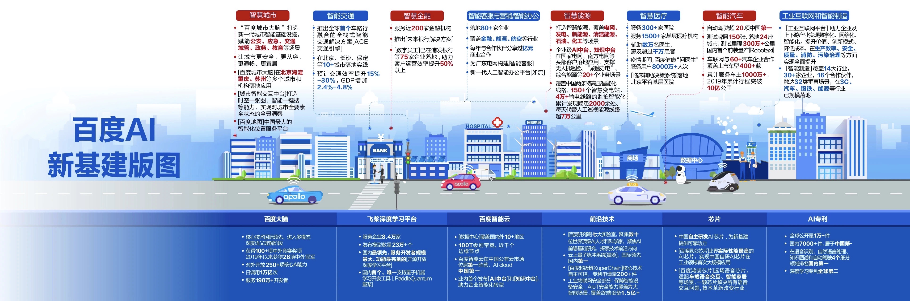

# Urban-computing-papers
Papers on urban computing

## 新基建

[1] [什么是新基建](http://www.xinhuanet.com/politics/2020-04/26/c_1125908061.htm)

[2] [百度AI新基建版图](https://mp.weixin.qq.com/s/Dn36outlTv6a89t9aKAZhA)

[3] [新基建项目盘点](https://github.com/Knowledge-Precipitation-Tribe/Urban-computing-papers/blob/master/pdf/%E9%A1%B9%E7%9B%AE%E7%9B%98%E7%82%B9.pdf)

## 白皮书
[1] [百度城市大脑白皮书](https://github.com/Knowledge-Precipitation-Tribe/Urban-computing-papers/blob/master/pdf/%E7%99%BE%E5%BA%A6%E5%9F%8E%E5%B8%82%E5%A4%A7%E8%84%91%E7%99%BD%E7%9A%AE%E4%B9%A6.pdf)

[2] [区块链赋能新型智慧城市白皮书](https://github.com/Knowledge-Precipitation-Tribe/Urban-computing-papers/blob/master/pdf/qukuailian.pdf)

[3] [京东云智能城市白皮书2019](https://github.com/Knowledge-Precipitation-Tribe/Urban-computing-papers/blob/master/pdf/%E4%BA%AC%E4%B8%9C%E4%BA%91%E6%99%BA%E8%83%BD%E5%9F%8E%E5%B8%82%E7%99%BD%E7%9A%AE%E4%B9%A62019.pdf)

[4] [中国智能城市发展战略与策略研究](https://github.com/Knowledge-Precipitation-Tribe/Urban-computing-papers/blob/master/pdf/JDCloud_intelligent_city_development_strategy_2019.pdf)

[5] [城市交通数字化转型白皮书](https://mp.weixin.qq.com/s/tspBdFa2wc0Yfcvj3BpxZA)

## Experts or AI lab

[1] Yu Zheng: [link](http://urban-computing.com/yuzheng)

[2] JD city : [link](http://icity.jd.com/)

[3] alibaba: [link](https://m.aliyun.com/markets/aliyun/citybraintraffic?spm=5176.12825654.eofdhaal5.151.54212c4aE2J0lt)

[4] Huawei: [link](https://e.huawei.com/cn/solutions/industries/smart-city)

[5] ByteDance: [link](https://ailab.bytedance.com/)

[6] alibaba damo academy: [link](https://damo.alibaba.com/labs/city-brain)

[7] Tencent: [link](https://ai.tencent.com/ailab/zh/index)

[8] Microsoft: [link](https://www.microsoft.com/en-us/ai/ai-lab)

[9] intel: [link](https://www.intel.com/content/www/us/en/artificial-intelligence/overview.html)

[10] FACEBOOK: [link](https://ai.facebook.com/)

[11] Google: [link](https://ai.google/)

[12] National Laboratory of Pattern Recognition: [link](http://www.nlpr.ia.ac.cn/cn/)

[13] Baidu: [link](https://cloud.baidu.com/)

[14] JD cloud: [link](https://www.jdcloud.com/cn/city/all)

## Dataset

[1] GAIA Open Dataset: [link](https://outreach.didichuxing.com/research/opendata/)

## Content

- <a href = "#trafic-forecasting">1. Trafic forecasting</a>
  - <a href = "#gnn-papers-on-traffic-forecasting">1.1 GNN papers on Traffic forecasting</a>
  - <a href = "#other-method-on-traffic-forecasting">1.2 Other method on Traffic forecasting</a>

## Relevant papers

### [Traffic forecasting](#content)

### [GNN papers on Traffic forecasting](#content)

Graph neural network on traffic forecasting

[1] **Spatio-Temporal Graph Convolutional Networks: A Deep Learning Framework for Traffic Forecasting.** IJCAI 2018. [paper](https://arxiv.org/pdf/1709.04875.pdf), [code](https://github.com/ShichengChen/Spatio-Temporal-Graph-Convolutional-Networks-A-Deep-Learning-Framework-for-Traffic-Forecasting).

**[Detailed analysis](https://github.com/Knowledge-Precipitation-Tribe/STGCN-keras/tree/master/ppt)**

*Bing Yu, Haoteng Yin, Zhanxing Zhu*

---

[2] **Spatiotemporal Multi-Graph Convolution Network for Ride-hailing Demand Forecasting.** AAAI 2019. [paper](http://www-scf.usc.edu/~yaguang/papers/aaai19_multi_graph_convolution.pdf).

*Xu Geng, Yaguang Li, Leye Wang, Lingyu Zhang, Qiang Yang, Jieping Ye, Yan Liu*

---

[3] **Spatio-Temporal Graph Structure Learning for Traffic Forecasting.** AAAI 2020. [paper](https://www.aaai.org/Papers/AAAI/2020GB/AAAI-ZhangQ.7934.pdf).

*Qi Zhang, Jianlong Chang, Gaofeng Meng, Shiming Xiang, Chunhong Pan*

---

[4] **GMAN: A Graph Multi-Attention Network for Traffic Prediction.** AAAI 2020. [paper](https://arxiv.org/pdf/1911.08415.pdf), [code](https://github.com/zhengchuanpan/GMAN).

*Chuanpan Zheng, Xiaoliang Fan, Cheng Wang, Jianzhong Qi*

---

[5] **Graph WaveNet for Deep Spatial-Temporal Graph Modeling.** IJCAI 2019. [paper](https://arxiv.org/abs/1906.00121).

*Zonghan Wu, Shirui Pan, Guodong Long, Jing Jiang, Chengqi Zhang*

---

[6] **Spatial-Temporal Synchronous Graph Convolutional Networks: A New Framework for Spatial-Temporal Network Data Forecasting.** AAAI 2020. [paper](https://www.aaai.org/Papers/AAAI/2020GB/AAAI-SongC.8074.pdf), [code](https://github.com/Davidham3/STSGCN).

*Chao Song, Youfang Lin, Shengnan Guo, Huaiyu Wan*

---

[7] **DIFFUSION CONVOLUTIONAL RECURRENT NEURAL NETWORK: DATA-DRIVEN TRAFFIC FORECASTING.** ICLR 2018. [paper](https://arxiv.org/abs/1707.01926).

*Yaguang Li, Rose Yu, Cyrus Shahabi, Yan Liu*

---

[8] **Attention Based Spatial-Temporal Graph Convolutional Networks for Traffic Flow Forecasting.** AAAI 2019. [paper](https://www.aaai.org/ojs/index.php/AAAI/article/view/3881) [code](https://github.com/Davidham3/ASTGCN).

*Shengnan Guo, Youfang Lin, Ning Feng, Chao Song, Huaiyu Wan*

### [Other method on Traffic forecasting ](#content)

loading...