# Urban-computing-papers

 

# Introduction

This project is a collection of recent research in areas such as new infrastructure and urban computing, including white papers, academic papers, AI lab and dataset etc.

# Contribute

Contributions are always welcome! Make an individual pull request for each suggestion.

# Content

- <a href = "#New-infrastructure">New infrastructure</a>
- <a href = "#WhitePaper">WhitePaper</a>
- <a href = "#Expert">Expert</a>
- <a href = "#AI-Lab">AI Lab</a>
- <a href = "#Dataset">Dataset</a>
  - <a href = "#Sensor-data">Sensor-data</a>
  - <a href = "#Trajectory-data">Trajectory data</a>
  - <a href = "#Demand-data">Demand data</a>
  - <a href = "#Public-transportation-system-transaction-records">Public transportation system transaction records</a>

## **Method summary**

- <a href = "#Mind-map">Mind map</a>
- <a href = "#Spatial-dependence-modeling">Spatial dependence modeling</a>
- <a href = "#Temporal-dependence-modeling">Temporal dependence modeling</a>
- <a href = "#External-factors">External factors</a>
- <a href = "#Tricks">Tricks</a>

## **Relevant papers**

- <a href = "#Survey">Survey</a>
- <a href = "#GNN">GNN</a>
- <a href ="#Long-term-Dependencies">Long-term Dependencies</a>
- <a href = "#trafic-forecasting">1. Trafic forecasting</a>
  - <a href = "#gnn-papers-on-traffic-forecasting">1.1 GNN methods on Traffic forecasting</a>
  - <a href = "#other-method-on-traffic-forecasting">1.2 Other methods on Traffic forecasting</a>
- <a href = "Flows Prediction">2. Flows Prediction</a>
- <a href = "Demand Prediction">3. Demand Prediction</a>

# [New infrastructure](#content)

[1] [What is new infrastructure](http://www.xinhuanet.com/politics/2020-04/26/c_1125908061.htm)

[2] [Baidu AI new infrastructure layout](https://mp.weixin.qq.com/s/Dn36outlTv6a89t9aKAZhA)

[3] [Inventory of new infrastructure projects](https://github.com/Knowledge-Precipitation-Tribe/Urban-computing-papers/blob/master/pdf/%E9%A1%B9%E7%9B%AE%E7%9B%98%E7%82%B9.pdf)

[4] [Map of new infrastructure enterprises](./img/map.jpeg)

# [WhitePaper](#content)
[1] [百度城市大脑白皮书](https://github.com/Knowledge-Precipitation-Tribe/Urban-computing-papers/blob/master/pdf/%E7%99%BE%E5%BA%A6%E5%9F%8E%E5%B8%82%E5%A4%A7%E8%84%91%E7%99%BD%E7%9A%AE%E4%B9%A6.pdf)

[2] [区块链赋能新型智慧城市白皮书](https://github.com/Knowledge-Precipitation-Tribe/Urban-computing-papers/blob/master/pdf/qukuailian.pdf)

[3] [京东云智能城市白皮书2019](https://github.com/Knowledge-Precipitation-Tribe/Urban-computing-papers/blob/master/pdf/%E4%BA%AC%E4%B8%9C%E4%BA%91%E6%99%BA%E8%83%BD%E5%9F%8E%E5%B8%82%E7%99%BD%E7%9A%AE%E4%B9%A62019.pdf)

[4] [中国智能城市发展战略与策略研究](https://github.com/Knowledge-Precipitation-Tribe/Urban-computing-papers/blob/master/pdf/JDCloud_intelligent_city_development_strategy_2019.pdf)

[5] [城市交通数字化转型白皮书](https://mp.weixin.qq.com/s/tspBdFa2wc0Yfcvj3BpxZA)

[6] [赛迪白皮书：2020城市新基建布局与发展白皮书](https://github.com/Knowledge-Precipitation-Tribe/Urban-computing-papers/blob/master/pdf/赛迪白皮书：2020城市新基建布局与发展白皮书.pdf)

[7] [赛迪报告：中国“新基建”发展研究报告](https://github.com/Knowledge-Precipitation-Tribe/Urban-computing-papers/blob/master/pdf/赛迪报告：中国"新基建"发展研究报告.pdf)

[8] [新基建，新机遇：中国智能经济发展白皮书](https://github.com/Knowledge-Precipitation-Tribe/Urban-computing-papers/blob/master/pdf/%E6%96%B0%E5%9F%BA%E5%BB%BA%EF%BC%8C%E6%96%B0%E6%9C%BA%E9%81%87%EF%BC%9A%E4%B8%AD%E5%9B%BD%E6%99%BA%E8%83%BD%E7%BB%8F%E6%B5%8E%E5%8F%91%E5%B1%95%E7%99%BD%E7%9A%AE%E4%B9%A6%20(%E7%B2%BE%E5%8D%8E%E7%89%88).pdf)

[9] [新基建政策白皮书](https://github.com/Knowledge-Precipitation-Tribe/Urban-computing-papers/blob/master/pdf/"新基建"政策白皮书.pdf)

[10] [新基建发展白皮书](https://github.com/Knowledge-Precipitation-Tribe/Urban-computing-papers/blob/master/pdf/"新基建"发展白皮书.pdf)

[11] [我国各省市新基建发展潜力白皮书](https://github.com/Knowledge-Precipitation-Tribe/Urban-computing-papers/blob/master/pdf/我国各省区市"新基建"发展潜力白皮书.pdf)

[12] [中国城市人工智能发展指数报告](https://github.com/Knowledge-Precipitation-Tribe/Urban-computing-papers/blob/master/pdf/中国城市人工智能发展指数报告.pdf)

[13] [人工智能与工业融合发展研究报告](https://github.com/Knowledge-Precipitation-Tribe/Urban-computing-papers/blob/master/pdf/人工智能与工业融合发展研究报告.pdf)

[14] [2020年中国智慧城市发展研究报告](https://github.com/Knowledge-Precipitation-Tribe/Urban-computing-papers/blob/master/pdf/2020年中国智慧城市发展研究报告.pdf)

[15] [数据生产力崛起：新动能 新治理](https://github.com/Knowledge-Precipitation-Tribe/Urban-computing-papers/blob/master/pdf/%E6%95%B0%E6%8D%AE%E7%94%9F%E4%BA%A7%E5%8A%9B%E5%B4%9B%E8%B5%B7%EF%BC%9A%E6%96%B0%E5%8A%A8%E8%83%BD%20%E6%96%B0%E6%B2%BB%E7%90%86.pdf)

# [Expert](#content)

[1] Yu Zheng: [link](http://urban-computing.com/yuzheng)

[2] Yanhua Li: [link](http://users.wpi.edu/~yli15/index.html)

[3] Xun Zhou: [link](https://www.biz.uiowa.edu/faculty/xzhou/)

[4] YaGuang Li: [link](http://www-scf.usc.edu/~yaguang/)

[5] Zhenhui Jessie Li: [link](https://faculty.ist.psu.edu/jessieli/Site/index.html)

[6] David S. Rosenblum: [link](https://www.comp.nus.edu.sg/~david/)

[7] Huaiyu Wan: [link](http://faculty.bjtu.edu.cn/8793/)

[8] Junbo Zhang: [link](https://zhangjunbo.org/)

[9] Shining Xiang:[link](https://scholar.google.com/citations?hl=zh-CN&user=0ggsACEAAAAJ)

# [AI Lab](#content)

[1] iFly Tek: [link](https://www.iflytek.com/city)

[2] JD city : [link](http://icity.jd.com/)

[3] alibaba: [link](https://m.aliyun.com/markets/aliyun/citybraintraffic?spm=5176.12825654.eofdhaal5.151.54212c4aE2J0lt)

[4] Huawei: [link](https://e.huawei.com/cn/solutions/industries/smart-city)

[5] ByteDance: [link](https://ailab.bytedance.com/)

[6] alibaba damo academy: [link](https://damo.alibaba.com/labs/city-brain)

[7] Tencent: [link](https://ai.tencent.com/ailab/zh/index)

[8] Microsoft: [link](https://www.microsoft.com/en-us/ai/ai-lab)

[9] intel: [link](https://www.intel.com/content/www/us/en/artificial-intelligence/overview.html)

[10] FACEBOOK: [link](https://ai.facebook.com/)

[11] Google: [link](https://ai.google/)

[12] National Laboratory of Pattern Recognition: [link](http://www.nlpr.ia.ac.cn/cn/)

[13] Baidu: [link](https://cloud.baidu.com/)

[14] JD cloud: [link](https://www.jdcloud.com/cn/city/all)

[15] **Urban Computing Foundation Interactive Landscape: [link](https://landscape.uc.foundation/)**

# [Dataset](#content)

[1] GAIA Open Dataset: [link](https://outreach.didichuxing.com/research/opendata/)

[2] 智慧足迹: [link](http://www.smartsteps.com/)

## [Sensor data](#content)

[1] UK traffic flow datasets: [link](https://www.gov.uk/)

[2] Illinois traffic flow datasets: [link](http://www.travelmidwest.com/)

[3] PeMS: [link](http://pems.dot.ca.gov/), [Baidu Netdisk](https://pan.baidu.com/s/1c3NNV7nGnDylFJ9tBYUF0g) password:jutw | [PeMS Guide](https://github.com/Knowledge-Precipitation-Tribe/Urban-computing-papers/blob/master/PEMS.md)

## [Trajectory data](#content)

[1] Chengdu: [link](https://outreach.didichuxing.com/app-vue/TTItrajectory?id=1001)

[2] Xian: [link](https://outreach.didichuxing.com/app-vue/TTItrajectory?id=1001)

## [Others](#content)

[1] Weather and events data: [link](https://www.wunderground.com/)

[2] Weather and climate data: [link](https://www.ncdc.noaa.gov/data-access)

[3] NSW POI data: [link](https://sdi.nsw.gov.au/catalog/search/resource/details.page?uuid=%7BC41F6FE5-1C56-4556-%209EC6-EC9BD7094BBB%7D)

[4] Road network data: [link](http://networkrepository.com/road.php)

[5] NYC OpenData: [link](https://opendata.cityofnewyork.us/)

[6] METR-LA: [link](http://geohub.lacity.org/datasets/traffic-data?geometry=-119.170%2C33.900%2C-117.193%2C34.298), [Baidu Netdisk](https://pan.baidu.com/s/1g9yxZMDVf9nI0eN-ixeiPQ) password:xsz5

[7] TaxiBJ: [link](https://github.com/TolicWang/DeepST/tree/master/data/TaxiBJ), [Baidu Netdisk](https://pan.baidu.com/s/1aoi7gEkFQFn2MTYlGuc7Iw) password:sg4n

[8] BikeNYC: [link](https://www.citibikenyc.com/system-data), [Baidu Netdisk](https://pan.baidu.com/s/1SdSPWu5c761H3e8XjtzuaA) password:lmwj

[9] NYC-Taxi: [link](https://www1.nyc.gov/site/tlc/about/tlc-trip-record-data.page), [Baidu Netdisk](https://pan.baidu.com/s/1W2UV-xiDG_wbM9tuPvfrsA) password:022y

[10] NYC-Bike: [link](https://www.citibikenyc.com/system-data)

[11] San Francisco taxi: [link](https://crawdad.org/)

[12] Chicago bike: [link](https://www.divvybikes.com/system-data)

[13] BikeDC: [link](https://www.capitalbikeshare.com/system-data)

# [Method summary](#content)

## [Mind map](#content)

[中文版思维导图](https://github.com/Knowledge-Precipitation-Tribe/Urban-computing-papers/blob/master/img/Urban-computing.png)

## [Spatial dependence modeling](#content)

| Reference                       | Modules | description                                                  | Architecture                            |
| ------------------------------- | ------- | ------------------------------------------------------------ | --------------------------------------- |
| <a href = "#threeone">[3.1]</a> | CNN     | First convert the city into grid-shaped data, and then use CNN to capture spatial dependencies. Expand the size of the receptive field by stacking convolutional layers. | 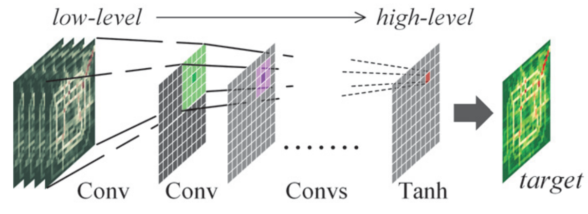 |
| <a href = "#threeone">[3.1]</a> | GCN     | The traffic network generally organizes as a graph structure. It is natural and reasonable to formulate road networks as graphs mathematically. The graph convolution is employed directly on graph-structured data to extract highly meaningful patterns and features in the space domain. |            |
|                                 |         |                                                              |                                         |
|                                 |         |                                                              |                                         |

## [Temporal dependence modeling](#content)

| Reference                       | Modules                    | description                                                  | Architecture                                       |
| ------------------------------- | -------------------------- | ------------------------------------------------------------ | -------------------------------------------------- |
| <a href = "#oneone">[1.1]</a>   | causal convolution         | Based on the past observation data, predict the possible future value $y$. Consider the sequence of time during the convolution process. If you want to model a long time sequence, you need to stack more convolutional layers. | 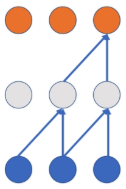               |
| <a href = "#onefive">[1.5]</a>  | dilated casual convolution | In order to solve the problems such as the disappearance of gradients, the explosion of gradients, and the difficulty of model training in long-term sequences caused by causal convolution. The time dependence can be modeled using dilated causal convolution. Dilated convolution achieves a larger receptive field with fewer convolutional layers by skipping part of the input. | 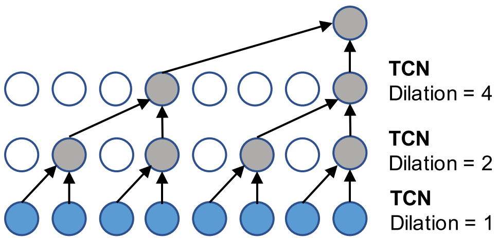 |
| <a href = "#twotwo">[2.2]</a>   | LSTM                       | Use Long Short-Term Memory (LSTM) network to capture the temporal sequential dependency, which is proposed to address the exploding and vanishing gradient issue of traditional Recurrent Neural Network (RNN). | 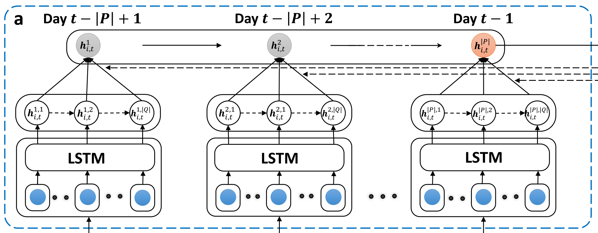          |
| <a href = "#oneseven">[1.7]</a> | GRU                        | Gated Recurrent Units (GRU) , which is a simple yet powerful variant of RNNs. | 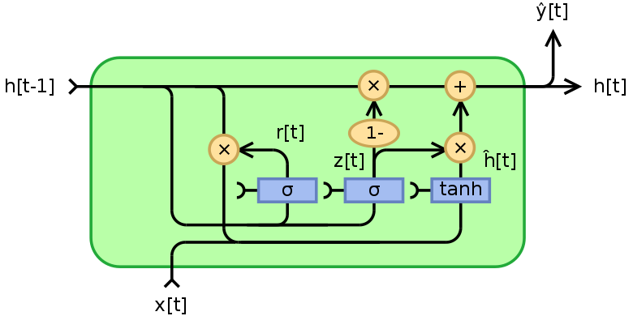           |

## [External factors](#content)

| Reference                       | Modules                | description                                                  | Architecture                             |
| ------------------------------- | ---------------------- | ------------------------------------------------------------ | ---------------------------------------- |
| <a href = "#threeone">[3.1]</a> | External Component     | Mainly consider weather, holiday event, and metadata (i.e. DayOfWeek, Weekday/Weekend). To predict flows at time interval $t$,the holiday event and metadata can be directly obtained. The weather  can use the forecasting weather at time interval $t$ or the approximate weather at time interval $t−1$. | 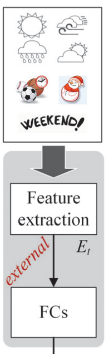 |
| <a href = "#twofour">[2.4]</a>  | External Factor Fusion | First incorporate the temporal factors including time features, meteorological features, and SensorID which specifies the target sensor. weather  can use the forecasting weather at time interval $t$. Most of these factors are categorical which cannot be fed to neural networks directly, we transform each categorical attribute into a low- dimensional vector by feeding them into different embedding layers separately. | 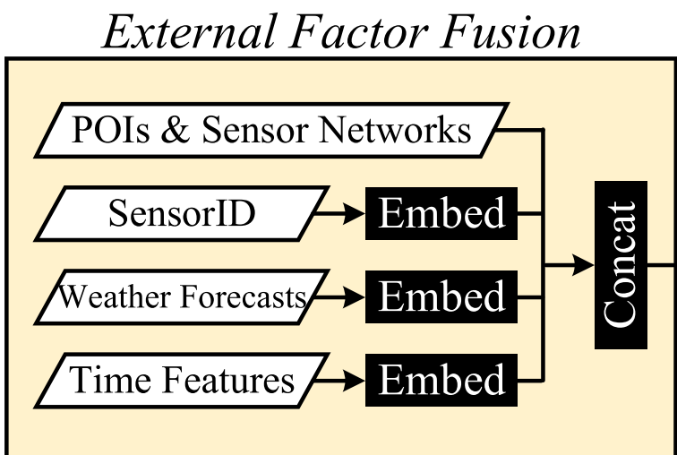     |
|                                 |                        |                                                              |                                          |
|                                 |                        |                                                              |                                          |

## [Tricks](#content)

| Reference                       | Modules             | description                                                  | Architecture                         |
| ------------------------------- | ------------------- | ------------------------------------------------------------ | ------------------------------------ |
| <a href = "#threeone">[3.1]</a> | Residual connection | As the network deepens, the accuracy of the training set has decreased. We can be sure that this is not caused by overfitting (the training set should have a high accuracy in the case of overfitting); so the author raised this question A new kind of network, called deep residual network, which allows the network to deepen as much as possible. | 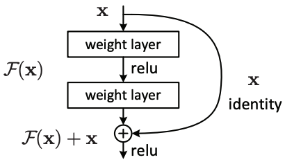 |
|                                 | Attention           |                                                              |                                      |
|                                 |                     |                                                              |                                      |
|                                 |                     |                                                              |                                      |

## Relevant papers

### [Survey](#content)

[1] **Urban Computing: Concepts, Methodologies, and Applications.** ACM Transactions on Intelligent Systems and Technology 2014. [paper](https://www.microsoft.com/en-us/research/wp-content/uploads/2016/02/UrbanComputing-zheng-tist2014.pdf)

*YU ZHENG, LICIA CAPRA, OURI WOLFSON, HAI YANG*

---

[2] **A Comprehensive Survey on Graph Neural Networks.** IEEE Transactions on Neural Networks and Learning Systems 2020. [paper](https://arxiv.org/pdf/1901.00596.pdf)

*Zonghan Wu, Shirui Pan, Fengwen Chen, Guodong Long, Chengqi Zhang, Philip S. Yu*

---

[3] **Batman or the Joker? The Powerful Urban Computing and its Ethics Issues.** SIGSPATIAL 2019. [paper](https://dl.acm.org/doi/abs/10.1145/3377000.3377003)

*Kaiqun Fu, Abdulaziz Alhamadani, Taoran Ji, Chang-Tien Lu*

---

[4] **Deep Learning for Spatio-Temporal Data Mining: A Survey.** arXiv [paper](https://arxiv.org/pdf/1906.04928.pdf)

*Senzhang Wang, Jiannong Cao, Fellow, Philip S. Yu*

---

[5] **Urban flows prediction from spatialtemporal data using machine learning: A survey.** Information Fusion 2020. [paper](https://www.sciencedirect.com/science/article/pii/S1566253519303094)

*Peng Xie, Tianrui Li, Jia Liu, Shengdong Du, Xin Yang, Junbo Zhang*

---

[6] **How to Build a Graph-Based Deep Learning Architecture in Traffic Domain: A Survey.** arXiv [paper](https://arxiv.org/pdf/2005.11691.pdf)

[translation](https://github.com/Knowledge-Precipitation-Tribe/How-to-Build-a-Graph-Based-Deep-Learning-Architecture-in-Traffic-Domain)

*Jiexia Ye, Juanjuan Zhao, Kejiang Ye, Chengzhong Xu*

---

[7] **A Survey on Modern Deep Neural Network for Traffic Prediction: Trends, Methods and Challenges.** TKDE 2020. [paper](https://ieeexplore.ieee.org/abstract/document/9112608)

*David Alexander Tedjopurnomo, Zhifeng Bao, Baihua Zheng, Farhana Murtaza Choudhury, Kai Qin*

---

[8] **A Survey of Hybrid Deep Learning Methods for Traffic Flow Prediction.** ICAIP 2019. [paper](https://dl.acm.org/doi/pdf/10.1145/3373419.3373429)

*Yan Shi, Haoran Feng, Xiongfei Geng, Xingui Tang, Yongcai Wang*

### [GNN](#content)

[1] **GRAPH ATTENTION NETWORKS.** ICLR 2018. [paper](https://arxiv.org/pdf/1710.10903.pdf)

*Petar Veliˇckovi´, Guillem Cucurull, Arantxa Casanova, Adriana Romero, Pietro Li`, Yoshua Bengio*

---

[2] **AM-GCN: Adaptive Multi-channel Graph Convolutional Networks.** SIGKDD 2020. [paper](http://www.shichuan.org/doc/86.pdf)

*Xiao Wang, Meiqi Zhu, Deyu Bo, Peng Cui, Chuan Shi, Jian Pei*

---

[3] **Heterogeneous Graph Neural Network.** SIGKDD 2019. [paper](https://dl.acm.org/doi/abs/10.1145/3292500.3330961)

*Chuxu Zhang, Dongjin Song, Chao Huang, Ananthram Swami, Nitesh V. Chawla*

---

[4] **Adaptive Graph Convolutional Neural Networks.** AAAI 2018. [paper](https://arxiv.org/abs/1801.03226)

*Ruoyu Li, Sheng Wang, Feiyun Zhu, Junzhou Huang*

---

[5] **Temporal Graph Networks for Deep Learning on Dynamic Graphs.** arXiv 2020. [paper](https://arxiv.org/abs/2006.10637)

*Ben Chamberlain, Fabrizio Frasca, Davide Eynard, Federico Monti, Michael Bronstein*

---

[6] **GEOM-GCN: GEOMETRIC GRAPH CONVOLUTIONAL NETWORKS.** ICLR 2020. [paper](https://arxiv.org/abs/2002.05287)

*Hongbin Pei, Bingzhe Wei, Kevin Chen-Chuan Chang, Yu Lei, Bo Yang*

---

[7] **Investigating and Mitigating Degree-Related Biases in Graph Convolutional Networks.** CIKM 2020. [paper](https://arxiv.org/pdf/2006.15643.pdf)

*Xianfeng Tang, Huaxiu Yao, Yiwei Sun, Yiqi Wang, Jiliang Tang, Charu Aggarwal, Prasenjit Mitra, Suhang Wang*

---

[7] **TinyGNN: Learning Efficient Graph Neural Networks.** KDD 2020. [paper](https://www.kdd.org/kdd2020/accepted-papers/view/tinygnn-learning-efficient-graph-neural-networks)

*Bencheng Yan, Chaokun Wang, Gaoyang Guo, Yunkai Lou*

---

[8] **Graph Neural Architecture Search.** IJCAI 2020. [paper](https://www.ijcai.org/Proceedings/2020/195)

*Yang Gao, Hong Yang, Peng Zhang, Chuan Zhou, Yue Hu*

### [Long-term Dependencies](#content)

[1] **Learning Long-term Dependencies Using Cognitive Inductive Biases in Self-attention RNNs.** PMLR 2020. [paper](https://arxiv.org/pdf/1806.01261.pdf)

*Giancarlo Kerg, Bhargav Kanuparthi, Anirudh Goyal, Kyle Goyette, Yoshua Bengio, Guillaume Lajoie*

### [Traffic forecasting](#content)

### [GNN papers on Traffic forecasting](#content)

[1.1]
 

**Spatio-Temporal Graph Convolutional Networks: A Deep Learning Framework for Traffic Forecasting.** IJCAI 2018. [paper](https://arxiv.org/pdf/1709.04875.pdf), [github](https://github.com/ShichengChen/Spatio-Temporal-Graph-Convolutional-Networks-A-Deep-Learning-Framework-for-Traffic-Forecasting), [code](https://pan.baidu.com/s/1eCtxVTjEFYTmUVqHH9hV4Q)  密码:j6ak.

| Models |    Modules    |       Architecture        | conclusion                                                   |
| :----- | :-----------: | :-----------------------: | :----------------------------------------------------------- |
| STGCN  | GCN,Gated CNN | 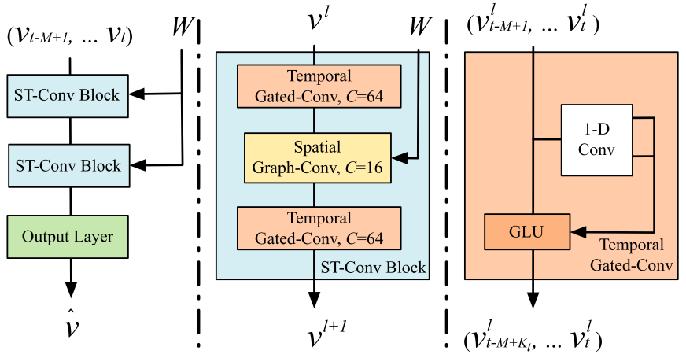 | This paper uses GCN to model spatial dependence, temporal dependence modeling uses causal convolution, and uses the gating mechanism GLU. The bottleneck strategy is used in the structure to achieve feature compression. This paper is also the first application of GCN in the field of transportation. |

**[Detailed analysis](https://github.com/Knowledge-Precipitation-Tribe/STGCN-keras/tree/master/ppt)**

*Bing Yu, Haoteng Yin, Zhanxing Zhu*

---

[1.2]

**Dynamic Graph Convolution Network for Traffic Forecasting Based on Latent Network of Laplace Matrix Estimation.** TITS 2020. [paper](https://ieeexplore.ieee.org/document/9190068)

| Models | Modules | Architecture | conclusion |
| :----: | :-----: | :----------: | :--------: |
|        |         |              |            |

*Kan Guo, Yongli Hu, ZhenQian, Yanfeng Sun, Junbin Gao, Baocai Yin*

---

[1.3]

**Spatio-Temporal Graph Structure Learning for Traffic Forecasting.** AAAI 2020. [paper](https://www.aaai.org/Papers/AAAI/2020GB/AAAI-ZhangQ.7934.pdf).

| Models |  Modules   |     Architecture      | conclusion                                                   |
| :----: | :--------: | :-------------------: | :----------------------------------------------------------- |
|  SLC   | SLCNN, P3D | 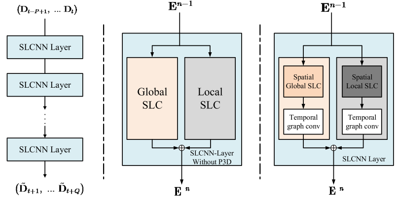 | This paper proposes a new type of graph convolution formula. **The article mentions that it is necessary to learn not only the feature information on the graph, but also the structure information of the graph**, which means that the structure of the graph changes dynamically. Use P3D to model the time dependence. |

*Qi Zhang, Jianlong Chang, Gaofeng Meng, Shiming Xiang, Chunhong Pan*

---

[1.4]

**GMAN: A Graph Multi-Attention Network for Traffic Prediction.** AAAI 2020. [paper](https://arxiv.org/pdf/1911.08415.pdf), [github](https://github.com/zhengchuanpan/GMAN), [code](https://pan.baidu.com/s/18vnklh--AhFEkjvIrZH3kg) 密码:4fdh.

| Models |                   Modules                    |      Architecture       | conclusion                                                   |
| :----: | :------------------------------------------: | :---------------------: | :----------------------------------------------------------- |
|  GMAN  | Encoder-Decoder,ST-Attention,Trans Attention | 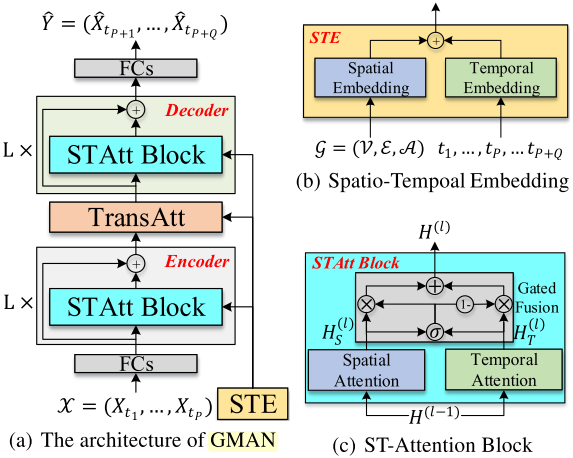 | This paper proposes a spatial-temporal attention mechanism with gated fusion to simulate complex spatial-temporal correlation. |

*Chuanpan Zheng, Xiaoliang Fan, Cheng Wang, Jianzhong Qi*

---

[1.5]

**Graph WaveNet for Deep Spatial-Temporal Graph Modeling.** IJCAI 2019. [paper](https://arxiv.org/abs/1906.00121), [github](https://github.com/nnzhan/Graph-WaveNet), [code](https://pan.baidu.com/s/1irrICIGnNkZLleZiLRVBYw) 密码:acfw.

| Models |              Modules               |     Architecture      | conclusion                                                   |
| :----: | :--------------------------------: | :-------------------: | :----------------------------------------------------------- |
|  GWN   | GCN with adaptive Matrix,Gated TCN | 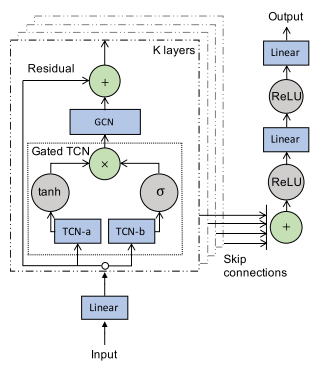 | This paper proposes a diffusion convolution formula with an adaptive adjacency matrix on the basis of DCRNN. During the training process, it also emphasizes that the structure of the graph changes dynamically. The paper uses two embedding vectors to dynamically learn the graph structure. Causal convolution is used to model time dependence. The overall structure of the model is similar to WaveNet. |

*Zonghan Wu, Shirui Pan, Guodong Long, Jing Jiang, Chengqi Zhang*

---

[1.6]

**Spatial-Temporal Synchronous Graph Convolutional Networks: A New Framework for Spatial-Temporal Network Data Forecasting.** AAAI 2020. [paper](https://www.aaai.org/Papers/AAAI/2020GB/AAAI-SongC.8074.pdf), [github](https://github.com/Davidham3/STSGCN), [code](https://pan.baidu.com/s/1RlzpUMMcoaQSIwz1B5aF8Q ) 密码:3jkd.

| Models |               Modules               |        Architecture         | conclusion                                                   |
| :----: | :---------------------------------: | :-------------------------: | :----------------------------------------------------------- |
| STSGCN | Spatial-Temporal Embedding, STSGCM, | 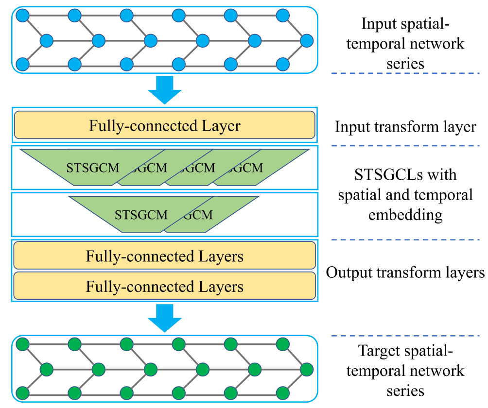 | This paper proposes a new structured local spatio-temporal graph. By combining the graph structures of adjacent time slices into a local spatio-temporal graph, a new adjacency matrix is constructed, which can simultaneously capture spatio-temporal dependence. |

*Chao Song, Youfang Lin, Shengnan Guo, Huaiyu Wan*

---

[1.7]
 

**DIFFUSION CONVOLUTIONAL RECURRENT NEURAL NETWORK: DATA-DRIVEN TRAFFIC FORECASTING.** ICLR 2018. [paper](https://arxiv.org/abs/1707.01926), [github](https://github.com/liyaguang/DCRNN), [code](https://pan.baidu.com/s/1ufAQxCt6dn-h16l-h_EfhQ)  密码:ba0q.

| Models |                       Modules                       |       Architecture        | conclusion                                                   |
| :----: | :-------------------------------------------------: | :-----------------------: | :----------------------------------------------------------- |
| DCRNN  | Diffusion Convolutional Layer, encoder-decoder, GRU | 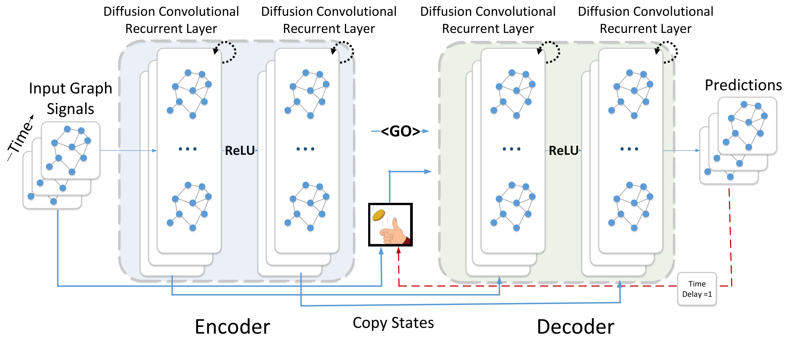 | This paper proposes diffusion convolution based on random walk for modeling spatio-temporal dependence. Use GRU to model time dependence. |

*Yaguang Li, Rose Yu, Cyrus Shahabi, Yan Liu*

---

[1.8]
 

**Attention Based Spatial-Temporal Graph Convolutional Networks for Traffic Flow Forecasting.** AAAI 2019. [paper](https://www.aaai.org/ojs/index.php/AAAI/article/view/3881) [github](https://github.com/guoshnBJTU/ASTGCN-r-pytorch), [code](https://pan.baidu.com/s/10gDoeRDXaH6UM2Am4rVRxw)  密码:nbje.

| Models |                   Modules                    |        Architecture         | conclusion                                                   |
| :----: | :------------------------------------------: | :-------------------------: | :----------------------------------------------------------- |
| ASTGCN | Spatial attention,Temporal attention,GCN,TCN |  | The model combines the spatial-temporal attention mechanism and the spatial-temporal convolution, including graph convolu- tions in the spatial dimension and standard convolutions in the temporal dimension, to simultaneously capture the dy- namic spatial-temporal characteristics of traffic data. |

*Shengnan Guo, Youfang Lin, Ning Feng, Chao Song, Huaiyu Wan*

---

[1.9]
 

**STGRAT: A Spatio-Temporal Graph Attention Network for Traffic Forecasting.** AAAI 2020. [paper](http://arxiv-export-lb.library.cornell.edu/pdf/1911.13181)

| Models | Modules | Architecture | conclusion |
| :----: | :-----: | :----------: | :--------: |
|        |         |              |            |

*Cheonbok Park , Chunggi Lee , Hyojin Bahng, Taeyun won*

---

[1.10]
 

**Temporal Multi-Graph Convolutional Network for Traffic Flow Prediction.** TITS 2020. [paper](https://ieeexplore.ieee.org/abstract/document/9098104)

| Models | Modules | Architecture | conclusion |
| :----: | :-----: | :----------: | :--------: |
|        |         |              |            |

*Mingqi Lv , Zhaoxiong Hong, Ling Chen , Tieming Chen, Tiantian Zhu , and Shouling Ji*

---

[1.11]
 

**Hybrid Spatio-Temporal Graph Convolutional Network: Improving Traffic Prediction with Navigation Data.** SIGKDD 2020. [paper](https://arxiv.org/pdf/2006.12715.pdf)

| Models | Modules | Architecture | conclusion |
| :----: | :-----: | :----------: | :--------: |
|        |         |              |            |

*Rui Dai, Shenkun Xu, Qian Gu, Chenguang Ji, Kaikui Liu*

---

[1.12]
 

**Multi-Range Attentive Bicomponent Graph Convolutional Network for Traffic Forecasting.** AAAI 2020. [paper](https://www.aaai.org/Papers/AAAI/2020GB/AAAI-ChenW.6413.pdf)

| Models | Modules | Architecture | conclusion |
| :----: | :-----: | :----------: | :--------: |
|        |         |              |            |

*Weiqi Chen, Ling Chen, Yu Xie, Wei Cao, Yusong Gao, Xiaojie Feng*

---

[1.13]
 

**LSGCN: Long Short-Term Traffic Prediction with Graph Convolutional Networks.** IJCAI 2020. [paper](https://www.ijcai.org/Proceedings/2020/0326.pdf)

| Models | Modules | Architecture | conclusion |
| :----: | :-----: | :----------: | :--------: |
|        |         |              |            |

*Rongzhou Huang , Chuyin Huang, Yubao Liu, Genan Dai, Weiyang Kong*

---

[1.14]

**Optimized Graph Convolution Recurrent Neural Network for Traffic Prediction.** TITS 2020. [paper](https://ieeexplore.ieee.org/document/8959420)

| Models | Modules | Architecture | conclusion |
| :----: | :-----: | :----------: | :--------: |
|        |         |              |            |

*Kan Guo, Yongli Hu, ZhenQian, Hao Liu, Ke Zhang, Yanfeng Sun, Junbin Gao, Baocai Yin*

---

[1.15]

**Dynamic Graph Convolution Network for Traffic Forecasting Based on Latent Network of Laplace Matrix Estimation.** TITS 2020. [paper](https://ieeexplore.ieee.org/document/9190068)

| Models | Modules | Architecture | conclusion |
| :----: | :-----: | :----------: | :--------: |
|        |         |              |            |

*Kan Guo, Yongli Hu, ZhenQian, Hao Liu, Ke Zhang, Yanfeng Sun, Junbin Gao, Baocai Yin*

---

[1.16]

**GSTNet: Global Spatial-Temporal Network for Traffic Flow Prediction.** IJCAI 2019. [paper](https://www.ijcai.org/Proceedings/2019/0317.pdf)

| Models | Modules | Architecture | conclusion |
| :----: | :-----: | :----------: | :--------: |
|        |         |              |            |

*Shen Fang, Qi Zhang, Gaofeng Meng, Shiming Xiang, Chunhong Pan*

---

[1.17]

**Short-Term Traffic Flow Forecasting Method With M-B-LSTM Hybrid Network.** TITS 2020. [paper](https://ieeexplore.ieee.org/document/9152107)

| Models | Modules | Architecture | conclusion |
| :----: | :-----: | :----------: | :--------: |
|        |         |              |            |

*Qu Zhaowei, Li Haitao, Li Zhihui, Zhong Tao*

---

[1.18]

**Traffic Graph Convolutional Recurrent Neural Network: A Deep Learning Framework for Network-Scale Traffic Learning and Forecasting.** TITS 2019. [paper](https://arxiv.org/abs/1802.07007)

| Models | Modules | Architecture | conclusion |
| :----: | :-----: | :----------: | :--------: |
|        |         |              |            |

*Zhiyong Cui, Kristian Henrickson, Ruimin Ke, Yinhai Wang*

---

### [Other method on Traffic forecasting ](#content)

[2.1]

**Urban Traffic Prediction from Spatio-Temporal Data Using Deep Meta Learning.** SIGKDD 2019. [paper](http://urban-computing.com/pdf/kdd_2019_camera_ready_ST_MetaNet.pdf)

| Models | Modules | Architecture | conclusion |
| :----: | :-----: | :----------: | :--------: |
|        |         |              |            |

*Zheyi Pan , Yuxuan Liang , Weifeng Wang, Yong Yu, Yu Zheng, Junbo Zhang*

---

[2.2]

**Revisiting Spatial-Temporal Similarity: A Deep Learning Framework for Traffic Prediction.** AAAI 2019. [paper](https://arxiv.org/pdf/1803.01254.pdf), [github](https://github.com/tangxianfeng/STDN), [code](https://pan.baidu.com/s/1GHHBZKuH0q2ZCkSIZR1j5A)  密码:7hu9

| Models |          Modules          |      Architecture       | conclusion                                                   |
| :----: | :-----------------------: | :---------------------: | :----------------------------------------------------------- |
|  STDN  | CNN, LSTM, Attention, FGM | 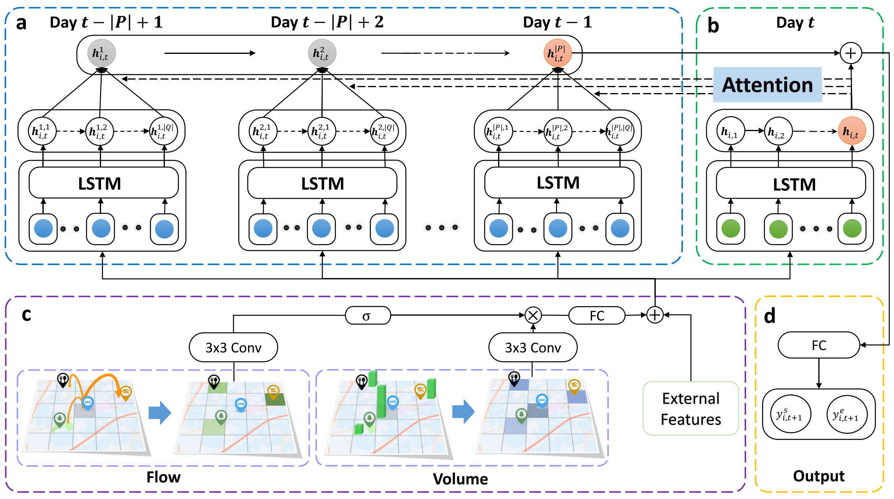 | This paper operates on grid data, using CNN for spatial dependence modeling, LSTM for temporal dependence modeling, and introducing an attention mechanism to model periodic changes in time. |

*Huaxiu Yao, Xianfeng Tang, Hua Wei, Guanjie Zheng, Zhenhui Li*

---

[2.3]

**Deep Spatial–Temporal 3D Convolutional Neural Networks for Traffic Data Forecasting.** TITS 2019. [paper](https://ieeexplore.ieee.org/abstract/document/8684259/)

| Models | Modules | Architecture | conclusion |
| :----: | :-----: | :----------: | :--------: |
|        |         |              |            |

*Shengnan Guo, Youfang Lin, Shijie Li, Zhaoming Chen, and Huaiyu Wan*

---

[2.4]

**GeoMAN: Multi-level Attention Networks for Geo-sensory Time Series Prediction.** IJCAI 2018. [paper](https://www.ijcai.org/Proceedings/2018/0476.pdf), [github](https://github.com/yoshall/GeoMAN), [code](https://pan.baidu.com/s/1hP-pTdzhhterbKFB5NbbHQ)  密码:vavc

| Models |                           Modules                           |        Architecture         | conclusion                                                   |
| :----: | :---------------------------------------------------------: | :-------------------------: | :----------------------------------------------------------- |
| GeoMAN | Spatial Attention,Temporal Attention, LSTM, Encoder-decoder | 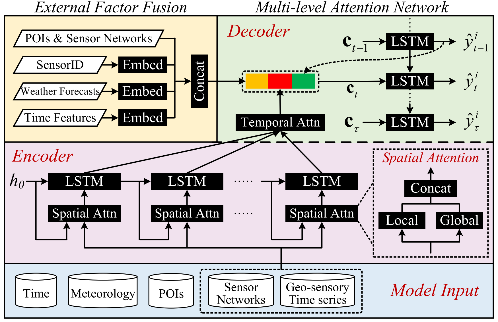 | This paper applies local and global spatial attention mechanisms to capture dynamic correlations between sensors in the data. And time attention is used to adaptively select the relevant time step to make the prediction. In addition, the proposed model takes into account the influence of external factors through a common fusion module. |

*Yuxuan Liang, Songyu Ke, Junbo Zhang, Xiuwen Yi, Yu Zheng*

---

[2.5]

**Preserving Dynamic Attention for Long-Term Spatial-Temporal Prediction.** SIGKDD 2020. [paper](https://arxiv.org/abs/2006.08849)

| Models | Modules | Architecture | conclusion |
| :----: | :-----: | :----------: | :--------: |
|        |         |              |            |

*Haoxing Lin, Rufan Bai,Weijia Jia,Xinyu Yang,Yongjian You*

---

[2.6]

**Self-Attention ConvLSTM for Spatiotemporal Prediction.** AAAI 2020. [paper](https://aaai.org/ojs/index.php/AAAI/article/view/6819)

| Models | Modules | Architecture | conclusion |
| :----: | :-----: | :----------: | :--------: |
|        |         |              |            |

*Zhihui Lin,Maomao Li,Zhuobin Zheng,Yangyang Cheng,Chun Yuan*

---

### [Flows Prediction](#content)

[3.1]
 

**Deep Spatio-Temporal Residual Networks for Citywide Crowd Flows Prediction.** AAAI 2017. [paper](https://arxiv.org/pdf/1610.00081.pdf)

|  Models   |         Modules         |          Architecture           | conclusion                                                   |
| :-------: | :---------------------: | :-----------------------------: | :----------------------------------------------------------- |
| ST-ResNet | CNN, Extract key frames | 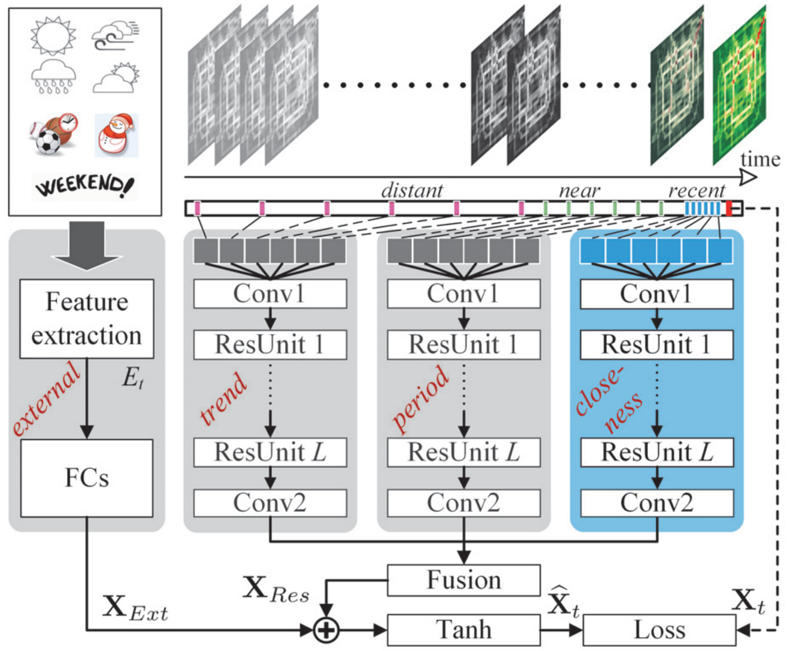 | This paper is an operation on grid data, using CNN plus residual connections to model spatial dependence, and using key frame extraction to simulate the trend, periodicity, and proximity in the time dimension, and consider external factors. |

*Junbo Zhang, Yu Zheng, Dekang Qi*

---

[3.2]
  

**UrbanFM: Inferring Fine-Grained Urban Flows.** SIGKDD 2019. [paper](https://arxiv.org/pdf/1902.05377.pdf)

| Models  |             Modules             |         Architecture          | conclusion                                                   |
| :-----: | :-----------------------------: | :---------------------------: | :----------------------------------------------------------- |
| UrbanFM | CNN, Upsampling, SubPixel Block | 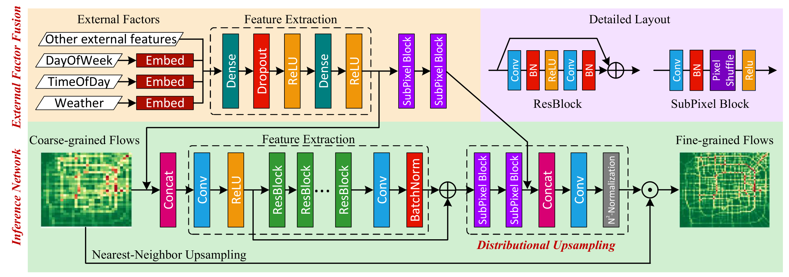 | This paper is similar to the resolution conversion of images, and aims to obtain more fine-grained traffic information in cities based on observations. |

*Yuxuan Liang, Kun Ouyang, Lin Jing, Sijie Ruan, Ye Liu1 Junbo Zhang, David S. Rosenblum, Yu Zheng*

---

[3.3]
  

**DeepSTD: Mining Spatio-Temporal Disturbances of Multiple Context Factors for Citywide Traffic Flow Prediction.** TITS 2019. [paper](https://ieeexplore.ieee.org/abstract/document/8793226)

| Models | Modules | Architecture | conclusion |
| :----: | :-----: | :----------: | :--------: |
|        |         |              |            |

*Chuanpan Zheng, Xiaoliang Fan, Chenglu Wen, Longbiao Chen, Cheng Wang, Jonathan Li*

---

[3.4]
  

**Dynamic Spatial-Temporal Representation Learning for Traffic Flow Prediction.** TITS 2020. [paper](https://ieeexplore.ieee.org/abstract/document/9127874/)

| Models | Modules | Architecture | conclusion |
| :----: | :-----: | :----------: | :--------: |
|        |         |              |            |

*Lingbo Liu, Jiajie Zhen, Guanbin Li , Geng Zhan, Zhaocheng He,Bowen Du,Liang Lin*

---

[3.5]
  

**AutoST: Efficient Neural Architecture Search for Spatio-Temporal Prediction.** SIGKDD 2020. [paper](http://urban-computing.com/pdf/AutoST_kdd20_camera_ready.pdf)

| Models | Modules | Architecture | conclusion |
| :----: | :-----: | :----------: | :--------: |
|        |         |              |            |

*Ting Li, Junbo Zhang, Kainan Bao, Yuxuan Liang, Yexin Li, Yu Zheng*

---

[3.6]
  

**Flow Prediction in Spatio-Temporal Networks Based on Multitask Deep Learning.** TKDE 2020. [paper](https://ieeexplore.ieee.org/document/8606218)

| Models | Modules | Architecture | conclusion |
| :----: | :-----: | :----------: | :--------: |
|        |         |              |            |

*Junbo Zhang, Yu Zheng, Junkai Sun, Dekang Qi*

---

[3.7]
  

**Multi-Graph Convolutional Network for Short-Term Passenger Flow Forecasting in Urban Rail Transit.** IET Intelligent Transport Systems 2020. [paper](https://arxiv.org/pdf/2001.07512.pdf)

| Models | Modules | Architecture | conclusion |
| :----: | :-----: | :----------: | :--------: |
|        |         |              |            |

*Jinlei Zhang, Feng Chen, Yinan Guo, Xiaohong Li*

---

[3.8]
  

**Revisiting Convolutional Neural Networks for Urban Flow Analytics.** arXiv 2020. [paper](https://arxiv.org/pdf/2003.00895.pdf)

| Models | Modules | Architecture | conclusion |
| :----: | :-----: | :----------: | :--------: |
|        |         |              |            |

*Yuxuan Liang, Kun Ouyang1, Junbo Zhang, Yu Zheng, David S. Rosenblum*

---

[3.9]
  

**Citywide Traffic Flow Prediction Based on Multiple Gated Spatio-temporal Convolutional Neural Networks.** TKDD 2020. [paper](https://dl.acm.org/doi/abs/10.1145/3385414)

| Models | Modules | Architecture | conclusion |
| :----: | :-----: | :----------: | :--------: |
|        |         |              |            |

*CEN CHEN, KENLI LI,SIN G. TEO,XIAOFENG ZOU,KEQIN LI,ZENG ZENG*

---

[3.10]
  

**Physical-Virtual Collaboration Modeling for Intra-and Inter-Station Metro Ridership Prediction.** arXiv 2020. [paper](https://dl.acm.org/doi/abs/10.1145/3385414)

| Models | Modules | Architecture | conclusion |
| :----: | :-----: | :----------: | :--------: |
|        |         |              |            |

*Lingbo Liu, Jingwen Chen, Hefeng Wu, Jiajie Zhen, Guanbin Li, Liang Lin*

---

[3.10]
  

**Predicting Citywide Crowd Flows in Irregular Regions Using Multi-View Graph Convolutional Networks.** TKDE 2020. [paper](https://arxiv.org/abs/1903.07789)

| Models | Modules | Architecture | conclusion |
| :----: | :-----: | :----------: | :--------: |
|        |         |              |            |

*Junkai Sun, Junbo Zhang, Qiaofei Li, Xiuwen Yi, Yuxuan Liang, Yu Zheng*

---

### [Demand Prediction](#content)

[4.1]
 

**Deep Multi-View Spatial-Temporal Network for Taxi Demand Prediction.** AAAI 2018. [paper](https://arxiv.org/pdf/1802.08714.pdf)

| Models | Modules | Architecture | conclusion |
| :----: | :-----: | :----------: | :--------: |
|        |         |              |            |

*Huaxiu Yao, Fei Wu, Jintao Ke, Xianfeng Tang, Yitian Jia, Siyu Lu, Pinghua Gong, Jieping Ye, Zhenhui Li*

---

[4.2]
  

**Origin-Destination Matrix Prediction via Graph Convolution: a New Perspective of Passenger Demand Modeling.** SIGKDD 2019. [paper](https://dl.acm.org/doi/abs/10.1145/3292500.3330877)

| Models | Modules | Architecture | conclusion |
| :----: | :-----: | :----------: | :--------: |
|        |         |              |            |

*Yuandong Wang, Hongzhi Yin, Hongxu Chen, Tianyu Wo, Jie Xu*

---

[4.3]
  

**STG2Seq: Spatial-temporal Graph to Sequence Model for Multi-step Passenger Demand Forecasting.** IJCAI 2019. [paper](https://arxiv.org/abs/1905.10069)

| Models | Modules | Architecture | conclusion |
| :----: | :-----: | :----------: | :--------: |
|        |         |              |            |

*Lei Bai, Lina Yao , Salil.S Kanhere, Xianzhi Wang, Quan.Z Sheng*

---

[4.4]
  

**Taxi Demand Prediction Using Parallel Multi-Task Learning Model.** TITS 2020. [paper](https://ieeexplore.ieee.org/document/9172100)

| Models | Modules | Architecture | conclusion |
| :----: | :-----: | :----------: | :--------: |
|        |         |              |            |

*Chizhan Zhang, Fenghua Zhu, Xiao Wang, LeileiSun, Haina Tang, Yisheng Lv*

---

[4.5]
  

**Traffic Demand Prediction Based on Dynamic Transition Convolutiona.** TITS 2020. [paper](https://ieeexplore.ieee.org/document/9172100)

| Models | Modules | Architecture | conclusion |
| :----: | :-----: | :----------: | :--------: |
|        |         |              |            |

*Bowen Du, Xiao Hu, Leilei Sun, Junming Liu, Yanan Qiao, Weifeng Lv*

### [Travel time or Arrive time](#content)

[5.1]

**HetETA: Heterogeneous Information Network Embedding for Estimating Time of Arrival.** SIGKDD 2020. [paper](https://www.kdd.org/kdd2020/accepted-papers/view/heteta-heterogeneous-information-network-embedding-for-estimating-time-of-a) [github](https://github.com/didi/heteta), [code](https://pan.baidu.com/s/1ogQzIiw8xMPdqPvu3xXGgQ ) 密码:38k8

| Models |    Modules     |        Architecture         | conclusion                                                   |
| :----: | :------------: | :-------------------------: | :----------------------------------------------------------- |
| HetETA | GatedCNNs, GCN | 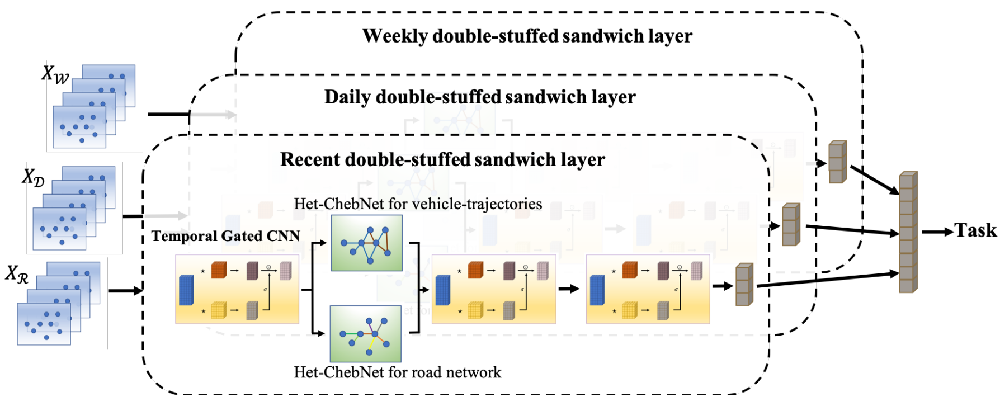 | HetETA combines gated convolution neural networks and graph neural networks to capture the correlations in spatiotemporal information. To tackle the different types of relationships among vertices, we design an attention-based Het-ChebNet and construct a double-stuffed graph convolution layer to embed our induced networks, including the multi-relational road network and vehicle-trajectories based network. Comprehensive |

*Huiting Hong, Yucheng Lin, Xiaoqing Yang, Zang Li, Kun Fu, Zheng Wang, Xiaohu Qie, Jieping Ye*

---

[5.2]

**CompactETA: A Fast Inference System for Travel Time Prediction.** KDD 2020. [paper](https://www.kdd.org/kdd2020/accepted-papers/view/compacteta-a-fast-inference-system-for-travel-time-prediction)

| Models | Modules | Architecture | conclusion |
| :----: | :-----: | :----------: | :--------: |
|        |         |              |            |

*Kun Fu, Fanlin Meng, Jieping Ye, Zheng Wang*

---

[5.3]

**Spatiotemporal Multi-Graph Convolution Network for Ride-hailing Demand Forecasting.** AAAI 2019. [paper](http://www-scf.usc.edu/~yaguang/papers/aaai19_multi_graph_convolution.pdf).

| Models |  Modules  |        Architecture         | conclusion                                                   |
| :----: | :-------: | :-------------------------: | :----------------------------------------------------------- |
| STMGCN | GCN,CGRNN | 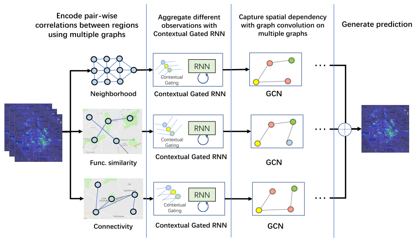 | This paper simulates complex spatial relationships by constructing multi-graphs, captures temporal dependencies by context-gated RNN, and captures spatial dependencies by GCN. |

*Xu Geng, Yaguang Li, Leye Wang, Lingyu Zhang, Qiang Yang, Jieping Ye, Yan Liu*
