# PeMS数据集

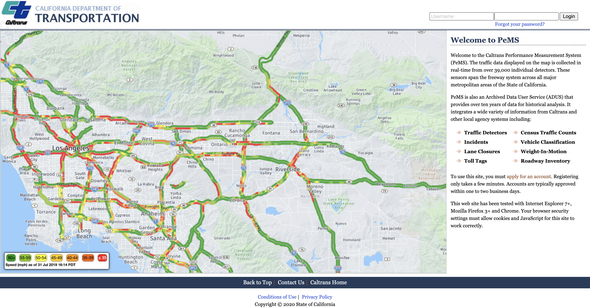

[PeMS](http://pems.dot.ca.gov/)(需科学上网)数据集是由美国加州高速公路性能测量系统(Performance Measurement System)所收集并汇总得到的数据，是交通领域使用非常广泛的一个数据集，但是现在缺少一个较为完整的教程来帮助大家获取原始数据和自己所需要的信息，本篇文章的目的就是要解决这个问题。

## 介绍

PeMS数据集提供了加州高速公路的各种监测数据，包括路况信息，车辆平均行速度，交通事故等。通过对得到的时空数据进行挖掘，建立适当的模型对交通状况进行预测，可以解决城市计算中的许多问题。

## 下载

下面我们通过例子演示如何下载PeMS数据集。

1. **首先注册并登陆PeMS官网**

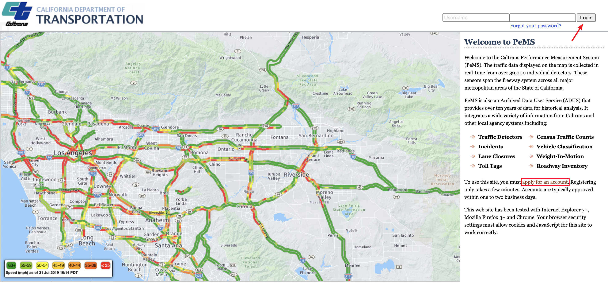

2. **成功登陆后，向下滑动页面，在页面左下角找到[Data Clearinghouse](http://pems.dot.ca.gov/?dnode=Clearinghouse)**

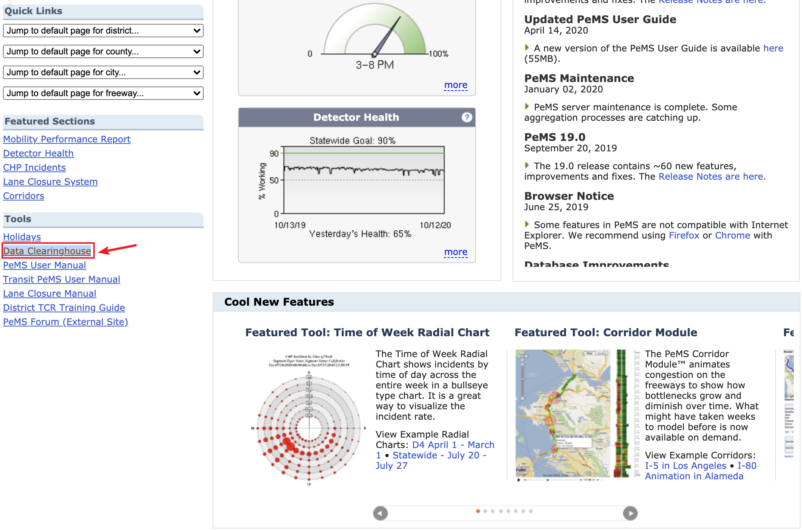

3. **进入Clearinghouse主界面后，在上方输入对应的Type和District**

PeMS系统上提供了多种数据集，一般我们使用Type为Station 5-Minute，对应的District选择需要的街区即可，比如我想要下载District 7的数据就进行下面的操作。

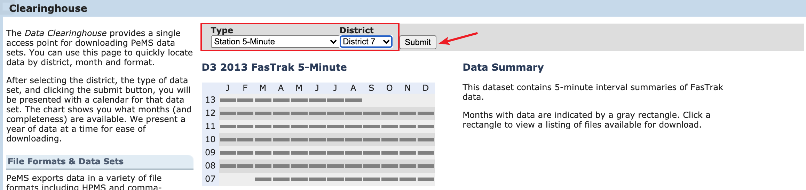

点击提交按钮后会在Available Files提供对应的数据集，默认提供最新的数据，左侧Field Specification提供了数据每列的详细解释。

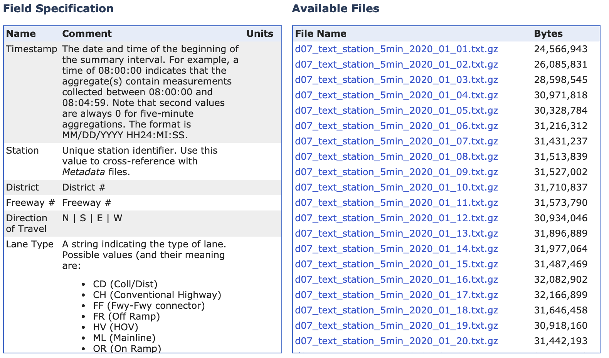

默认提供的是最新的数据，如果我们想要获取之前的历史数据，需要选择对应的日期，例如想要下载2017年3月份的数据。

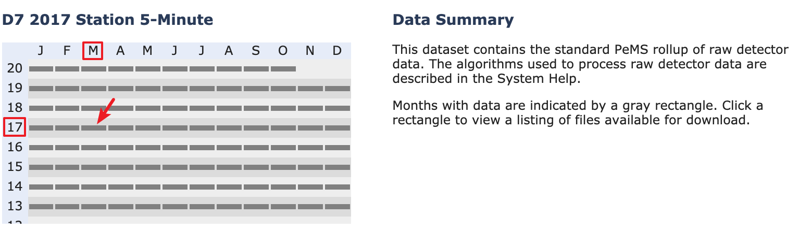

点击对应的**灰色按钮**后，下方的Available Files会提供你需要的数据，点击即可下载。

4. **解压下载的压缩包，观察数据**

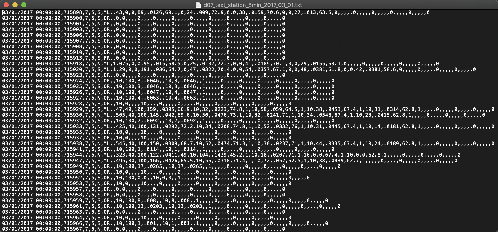

纯手动下载较为麻烦，这里提供一个[爬虫项目]()(待完善)来爬取相应的数据。

5. **下载metadata**

我们刚才下载到的数据仅包含每个传感器对应的观测值等信息，但是并不包含传感器本身的信息，我们通过如下操作可以下载到传感器的metadata。

首先修改Type为Station Metadata然后District选择District 7，具体操作如下

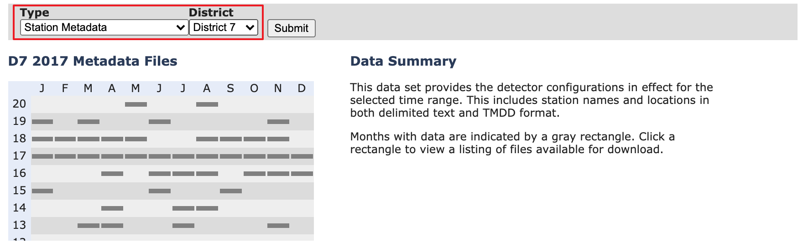

默认提供的仍然是最新的数据，然后我们仍然选择17年三月的作为案例进行下载。

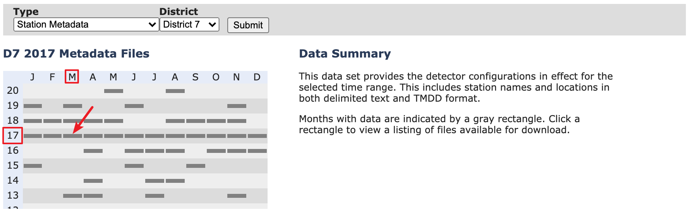

修改之后在下方的Available Files可以看到对应的可下载的数据信息。

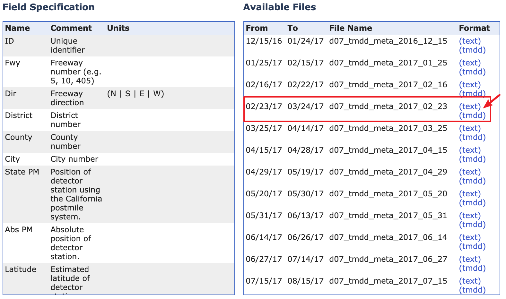

6. **查看metadata**

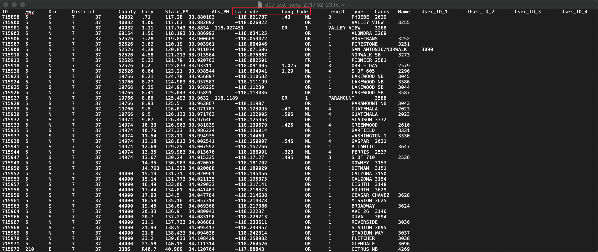

在这里看到传感器对应的经纬度，以及一些其他特征信息。通过获取到的经纬度信息我们可以在真实的地图上进行标点做进一步观察。

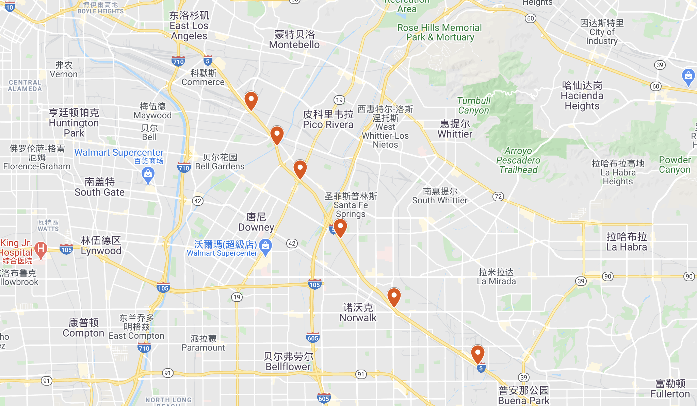

## 数据处理

我们来处理一下下载的2017年3月1日的数据，首先导入我们需要的库并观察一下数据

```python
import numpy as np
import pandas as pd

data = pd.read_table("./data/2017_03_01.txt", sep=",", header=None)
data.columns=['Timestamp', 'Station', 'District', 'Freeway', 'Direction of Travel', 'Lane Type', 'Station Length', 
              'Samples', '% Observed', 'Total Flow', 'Avg Occupancy', 'Avg Speed', 
              'Lane 1 Samples', 'Lane 1 Flow', 'Lane 1 Avg Occ', 'Lane 1 Avg Speed', 'Lane 1 Observed', 
              'Lane 2 Samples', 'Lane 2 Flow', 'Lane 2 Avg Occ', 'Lane 2 Avg Speed', 'Lane 2 Observed', 
              'Lane 3 Samples', 'Lane 3 Flow', 'Lane 3 Avg Occ', 'Lane 3 Avg Speed', 'Lane 3 Observed', 
              'Lane 4 Samples', 'Lane 4 Flow', 'Lane 4 Avg Occ', 'Lane 4 Avg Speed', 'Lane 4 Observed', 
              'Lane 5 Samples', 'Lane 5 Flow', 'Lane 5 Avg Occ', 'Lane 5 Avg Speed', 'Lane 5 Observed', 
              'Lane 6 Samples', 'Lane 6 Flow', 'Lane 6 Avg Occ', 'Lane 6 Avg Speed', 'Lane 6 Observed', 
              'Lane 7 Samples', 'Lane 7 Flow', 'Lane 7 Avg Occ', 'Lane 7 Avg Speed', 'Lane 7 Observed', 
              'Lane 8 Samples', 'Lane 8 Flow', 'Lane 8 Avg Occ', 'Lane 8 Avg Speed', 'Lane 8 Observed']

data.head()
```

输出结果如下

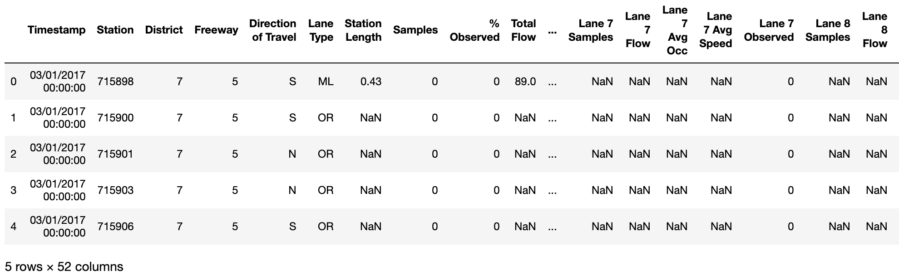

因为我们每条数据都是传感器检测得到的，我们将传感去分组查看一下数据情况

```python
number = data.groupby(['Station'])
number.size()
```

程序的输出结果如下

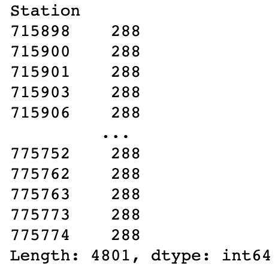

因为传感器是每5分钟汇总一次数据，所以一天会产生288条数据与我们观察到的一致，而且可以看到在District 7地区共有4801个传感器。

接下来我们主要对平均速度数据进行处理，首先看看速度的缺失值有多少

```python
speed = data['Avg Speed']
speed.isnull().sum()
# 输出：600192
```

原始数据中平均速度共有600192条缺失值，在一些论文中是采用线性插值的方式对缺失值进行填充，那我们接下来也采用同样的方式处理一下数据

```python
data['Avg Speed full'] = data['Avg Speed'].interpolate()
data['Avg Speed full'].head(10)
data['Avg Speed'].head(10)
```

程序输出结果如下图所示

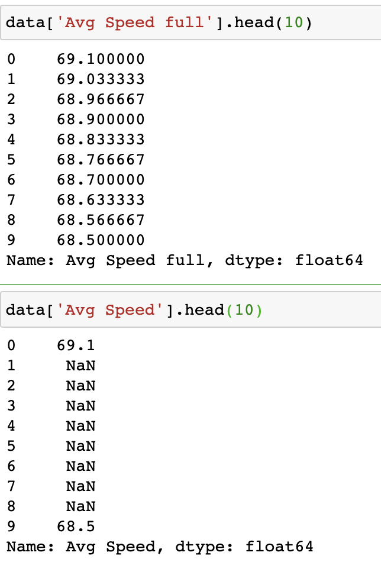

可以看到数据已经按照线行插值的方式对缺失值进行了补充。但是我们需要的不是这样的数据格式，我们想要将数据按照时间戳进行汇总，然后在每个时间戳下观察每个传感器的平均速度是多少，可以通过下面的方式实现

```python
new_data = data[['Timestamp','Station','Avg Speed full']]
speed_index = new_data.set_index(["Timestamp", "Station"])["Avg Speed full"]
new_df = speed_index.unstack()
new_df = new_df.rename_axis(columns=None)
new_df.head()
```

得到的数据结果如下

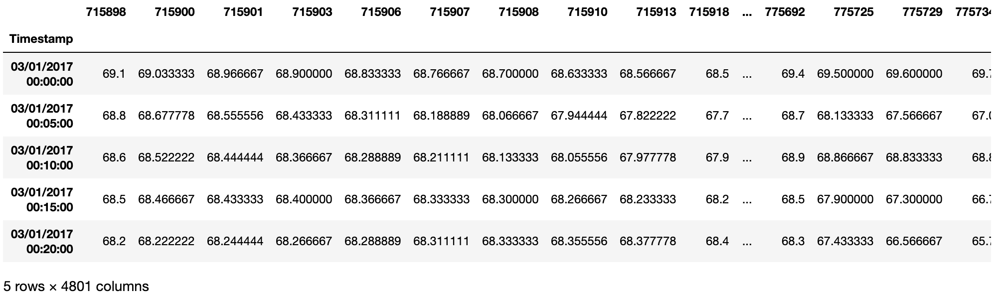

可以看到数据已经按照我们想要的格式进行了汇总，我们先对数据进行保存以用于下一步的操作。

```python
new_df.to_csv("./data/2017_03_01_full_speed.csv")
```


## 模型训练


## 参考

[1] [PeMS_intro_User_Guide](https://github.com/Knowledge-Precipitation-Tribe/Urban-computing-papers/blob/master/pdf/PeMS_Intro_User_Guide_v6.pdf)

